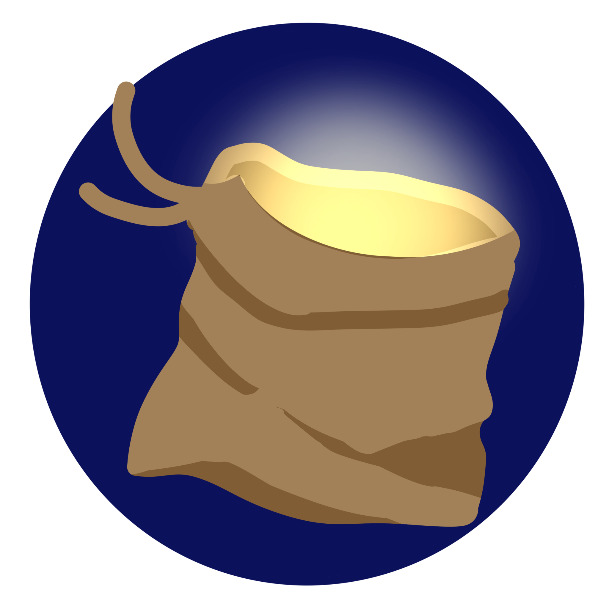
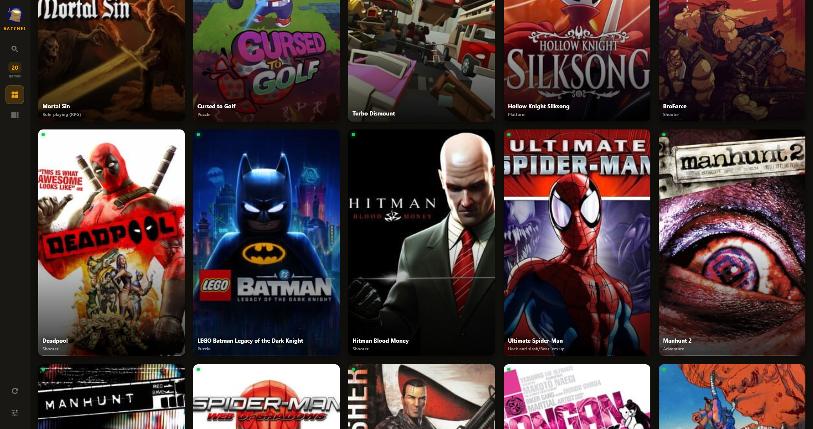
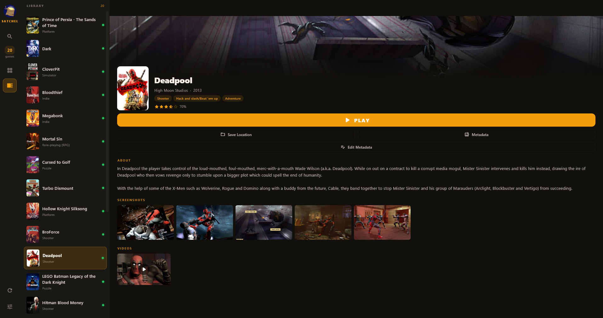

<p align="center">
  
</p>

<h1 align="center">Satchel</h1>

<p align="center">
  A portable, offline-first DRM-free game launcher that lives entirely on a USB drive.
</p>

## What Is This?

Satchel is a game library manager built for people who carry their games on a USB stick. It runs entirely from the drive — all metadata, cover art, settings, and save files live next to your games. Plug in the drive on any Windows PC (or macOS via Crossover, or Linux via Proton), and your library is there with full metadata, artwork, and save synchronization.

<p align="center">
  
</p>

<p align="center">
  
</p>

## How It Works

### The Drive

```
YourDrive/
├── Satchel/               # The launcher
│   ├── satchel.exe
│   └── thirdparty/
├── Config/                # Settings, API keys, game database
├── Games/                 # Drop your game folders here
│   ├── GameName/
│   │   ├── game.exe
│   │   └── .indie/        # Cached metadata & art (auto-created)
│   └── ...
├── Saves/                 # OmniSave backup saves
└── AutoRun.inf            # Auto-launches on Windows mount
```

### First Launch

1. Plug in your drive — Satchel auto-starts (Windows)
2. Setup wizard guides you through configuring paths and optional API keys
3. The launcher scans your `Games/` folder and detects executables automatically
4. Cover art, metadata, genres, ratings, and screenshots are fetched in the background
5. Everything is cached locally — after first setup, no internet needed

### Game Launching

Click **PLAY** on any game. Satchel handles:

- **Save synchronization** — saves are synced from the drive to your local system before launch, and back after you close the game. Your saves follow you between machines.
- **Process tracking** — the launcher knows when your game is running and shows "NOW PLAYING" across your library. Click **STOP** to gracefully close the game.
- **Double-launch protection** — trying to launch a second game shows a dialog asking to stop the current one first.

### Portable Paths

All paths are stored as `~/` notation (like OmniSave), relative to the drive root. This means:

- **Change drive letter** (H: → J:) — still works
- **Plug into macOS** — Crossover/Wine resolves the paths automatically
- **Linux via Proton** — same portable path system

The launcher finds the drive root by looking for the `Config/` folder, so it works regardless of where on the drive it's installed.

## Features

### Metadata & Art

- **IGDB integration** — full game info: summary, genres, developer, publisher, rating, release date, screenshots, and YouTube trailers
- **SteamGridDB integration** — high-quality grid art and cover images
- **ScreenScraper integration** — box art and screenshots (alternative source)
- **Art picker dialog** — search across all databases, pick the best result, downloads cover + banner + screenshots
- **Auto-fetch on startup** — background task fetches metadata for any game missing art
- **Manual metadata editor** — edit all fields (name, summary, genres, developer, publisher, rating) for games not found in databases
- **100% offline after first fetch** — all metadata, art, and screenshots cached in each game's `.indie/` folder

### Save Synchronization (OmniSave)

Satchel uses [OmniSave](https://github.com/abduznik/OmniSave) for automatic save file management:

- Before launching a game, saves are synced from the portable drive to the local system
- After closing the game, saves are synced back to the drive
- Your saves follow you between machines — no manual copying
- PCGamingWiki integration automatically detects where games store their saves
- Skip-sync option for games with portable saves (inside the game folder)

### Search

- Instant indexed search across game names, genres, developers, publishers, and summaries
- Results ranked by relevance (exact match > prefix > genre > developer)
- Ignores metadata source — searches both folder names and IGDB metadata

### Controller Support

- Full SDL2 gamepad stack with known controller mappings
- D-pad navigation, deadzone configuration, axis state machine
- Button hints bar and automatic input mode detection (mouse/keyboard/gamepad)

### Themes

6 built-in presets: Default Dark, Light, Crimson, Rose Gold, Neon Cyan, OLED Black

## What Uses the Network?

Satchel is designed to work offline. The network is only used for:

| Feature | When | What it does |
|---------|------|--------------|
| **Metadata fetch** | First time a game is scanned | Downloads game info from IGDB (genres, summary, rating, developer) |
| **Art download** | First time a game is scanned | Downloads cover art, banners, and screenshots from IGDB/SteamGridDB |
| **PCGamingWiki lookup** | When configuring save location | Looks up where a game stores its saves |
| **Trailer links** | On click (opens in browser) | YouTube video URLs are stored, not downloaded |
| **API key validation** | When adding/changing API keys | Verifies the key works with a test request |

**After first setup: zero network required.** All metadata, art, and game data live on the drive.

## Cross-Platform

| Platform | Method | Status |
|----------|--------|--------|
| **Windows** | Native | Fully supported |
| **macOS** | Crossover / Wine | Working — portable paths resolve automatically |
| **Linux** | Proton / Wine | Should work — same Wine path resolution |

The launcher is a Windows `.exe` (Flutter), but the portable `~/` path system means it works under Wine/Crossover/Proton without modification.

## API Keys (Optional)

API keys are optional — the launcher works without them, you just won't get automatic metadata.

| Service | What it provides | How to get a key |
|---------|-----------------|------------------|
| **IGDB** | Game info, genres, ratings, screenshots, trailers | Free via [Twitch Developer](https://dev.twitch.tv/console/apps) |
| **SteamGridDB** | Cover art and grid images | Free at [steamgriddb.com](https://www.steamgriddb.com/profile/preferences) |
| **ScreenScraper** | Box art and screenshots | Free tier at [screenscraper.fr](https://www.screenscraper.fr/) |

All keys are stored encrypted on the drive (`Config/keys.enc`) — never uploaded, never shared.

## Tech Stack

- **Flutter** — Cross-platform UI framework
- **Dart** — Application language
- **Riverpod** — State management
- **Hive** — Local storage (game database, settings)
- **Dio** — HTTP client for API calls
- **Material 3** — Design system with theme presets
- **OmniSave** — Save file synchronization

## Building

```bash
flutter pub get
flutter build windows
```

The built executable will be in `build/windows/x64/runner/Release/`.

## License

MIT
